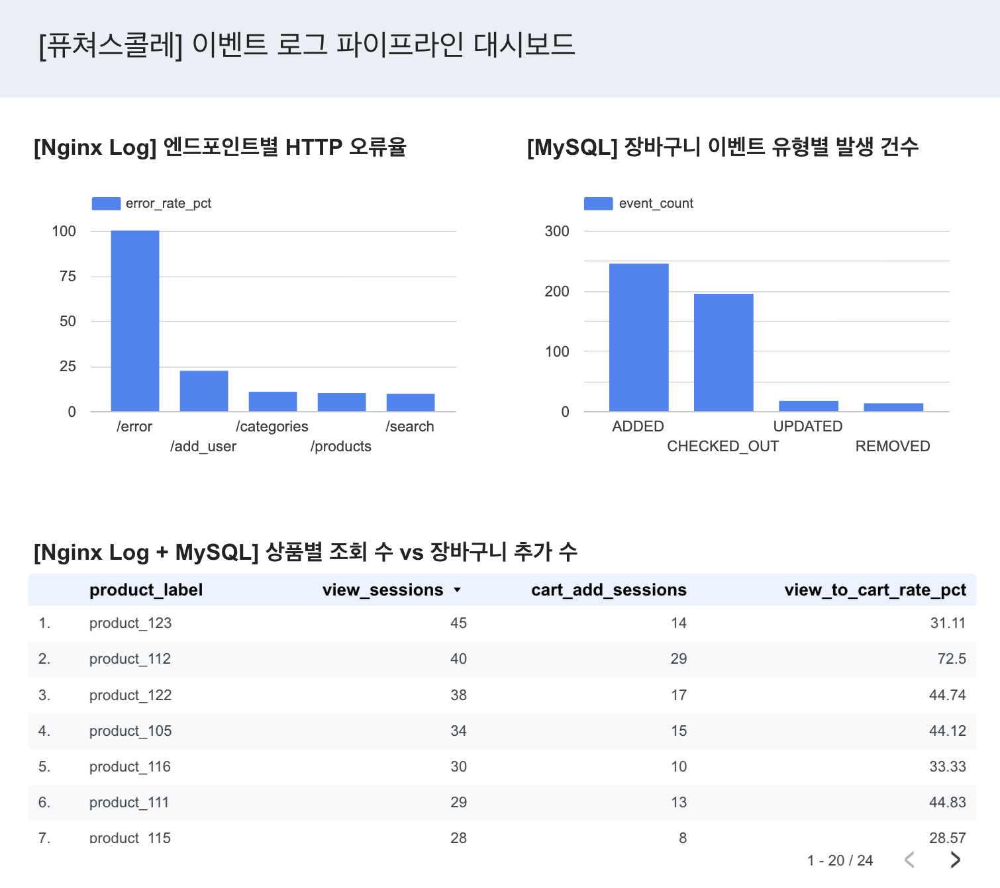

# 이커머스 이벤트 로그 파이프라인

이 아키텍처는 이커머스 플랫폼 API에서 발생하는 요청 로그와 MySQL 변경 이벤트를 분리 수집해 분석하는 이벤트 로그 파이프라인입니다. 요청 품질은 Nginx access log로 확인하고, 장바구니·주문 같은 비즈니스 상태 변경은 MySQL CDC로 추적하도록 구성했습니다.

학부 연구생 시절, 카카오클라우드 환경에서 MSP 엔지니어 실무 적용 지원용 데이터 분석 아키텍처를 직접 설계·구축한 경험이 있습니다. 이번 과제에서는 데이터 수집/저장/분석/시각화 파이프라인을 GCP 기준으로 요청 로그와 DB 변경 이벤트를 분리하고, 단일 VM과 GCP 관리형 서비스를 조합해 재현 가능한 이벤트 로그 파이프라인으로 구성했습니다.

---

## 1. 핵심 구성 요약

| 구분        | 구성                       | 역할                                |
| --------- | ------------------------ | --------------------------------- |
| 이벤트 생성    | `traffic-generator`      | 쇼핑몰 사용자 행동을 시뮬레이션해 API 요청 생성      |
| 이벤트 수신    | `api-server`             | Nginx + Flask API로 요청 처리          |
| 운영 데이터 저장 | `mysql`                  | 사용자, 상품, 장바구니, 주문, 리뷰, 검색 데이터 저장  |
| 로그 수집     | `filebeat`               | Nginx access log 파일 tailing       |
| 로그 처리     | `logstash`               | Nginx JSON log를 Kafka topic으로 전송  |
| 메시징       | GCP Managed Kafka        | Nginx log와 MySQL CDC topic 저장     |
| CDC       | Kafka Connect + Debezium | MySQL binlog 기반 DB 변경 이벤트 수집      |
| 장기 저장     | Cloud Storage            | Kafka topic 데이터를 JSON archive로 저장 |
| 분석        | BigQuery                 | External table과 view 기반 SQL 집계    |
| 시각화       | Looker Studio            | BigQuery 집계 결과 대시보드 구성            |

---

## 2. 과제 요구사항 매핑

| 과제 단계             | 구현 내용                                                                                      |
| ----------------- | ------------------------------------------------------------------------------------------ |
| Step 1. 이벤트 생성기   | `traffic-generator`가 쇼핑몰 사용자 행동을 지속적으로 생성합니다.                                              |
| Step 2. 로그 저장     | Nginx access log, MySQL table, Kafka topic, Cloud Storage JSON archive에 데이터를 필드 단위로 저장합니다. |
| Step 3. 데이터 집계 분석 | BigQuery external table과 view로 운영 품질, 장바구니 이벤트, 상품 관심도 지표를 집계합니다.                          |
| Step 4. Docker 실행 | `docker compose up --build -d`로 VM 내부 스택이 실행되고 이벤트 생성부터 저장까지 자동으로 동작합니다.                   |
| Step 5. 결과 시각화    | SQL 집계 결과를 Looker Studio로 시각화하고 `docs/images/dashboard.png`에 결과 이미지를 포함했습니다.               |

---

## 3. 전체 아키텍처

```text
[VM: Docker Compose]
traffic-generator
  -> api-server
      -> Nginx:80
      -> Gunicorn/Flask:8080
      -> MySQL:3306

Nginx access log
  -> Filebeat
  -> Logstash
  -> GCP Managed Kafka: nginx-topic
  -> Kafka Connect S3 Sink
  -> Cloud Storage: raw/nginx-json-logs

MySQL binlog
  -> Kafka Connect Debezium MySQL Source
  -> GCP Managed Kafka: mysql-server.shopdb.* topics
  -> Kafka Connect S3 Sink
  -> Cloud Storage: raw/mysql-cdc

Cloud Storage JSON
  -> BigQuery external tables
  -> BigQuery views
  -> Looker Studio dashboard
```

현재 구성은 과제 제출을 위한 단일 VM 기반 데모 파이프라인입니다. 운영 환경 수준의 고가용성까지 구현하지는 않았지만, 이벤트 생성, API 로그 수집, MySQL CDC, Kafka 전송, Cloud Storage 적재, BigQuery 분석, Looker Studio 시각화까지 데이터 파이프라인의 핵심 흐름을 한 번에 검증할 수 있게 구성했습니다.

--

## 4. 실행 방법 요약

이 아키텍처는 빈 GCP 프로젝트에서도 재현할 수 있도록 구성했습니다.

상세한 GCP 리소스 생성과 실행 명령은 [`docs/setup-guide.md`](docs/setup-guide.md), 실행 후 검증 절차는 [`docs/validation.md`](docs/validation.md)에 정리했습니다.

### 필요한 도구

| 도구 | 용도 |
| --- | --- |
| Google Cloud Shell 또는 Google Cloud CLI | GCP 리소스 생성 |
| GCP Console SSH | VM 접속 |
| Ubuntu VM | Docker Compose 실행 환경 |
| Docker Engine / Docker Compose plugin | 전체 스택 실행 |
| Git | 프로젝트 clone |
| BigQuery CLI | SQL 실행 |
| Looker Studio | SQL 집계 결과 시각화 |

---

## 5. 데이터 흐름 설계

### 5.1 Nginx access log

Nginx access log는 HTTP 요청 단위의 운영 데이터를 제공합니다.

| 분석 목적         | 사용 필드                                    |
| ------------- | ---------------------------------------- |
| endpoint별 오류율 | `endpoint`, `status`                     |
| 응답 지연 확인      | `request_time`, `upstream_response_time` |
| 사용자 흐름 확인     | `session_id`, `user_id`, `http_referer`  |
| 상품 관심도 확인     | `product_id`, `query_params`             |

Nginx log는 서비스 품질을 빠르게 확인하는 데 사용했습니다. API endpoint별 오류율과 요청 흐름을 MySQL 상태 변경과 분리해 분석할 수 있습니다.

### 5.2 MySQL CDC

MySQL CDC는 장바구니, 주문, 리뷰, 사용자 정보처럼 실제 DB에 반영된 상태 변경을 제공합니다.

| 분석 목적        | 사용 데이터                                |
| ------------ | ------------------------------------- |
| 장바구니 행동 분석   | `cart_logs`                           |
| 주문 상태 확인     | `orders`                              |
| 상품 관심도 연결    | Nginx `product_id` + CDC `product_id` |
| 사용자 행동 근거 확인 | `users`, `sessions`, `search_logs`    |

Debezium은 MySQL binlog를 읽어 `mysql-server.shopdb.*` Kafka topic에 변경 이벤트를 전달합니다. 애플리케이션 코드에 이벤트 발행 로직을 추가하지 않고 DB 상태 변경을 수집할 수 있습니다.

### 5.3 저장 계층

Kafka topic 데이터는 Cloud Storage에 JSON 형태로 저장합니다. 이후 BigQuery external table이 Cloud Storage 경로를 직접 조회합니다.

이 방식을 선택한 이유는 두 가지입니다.

| 결정                         | 이유                            |
| -------------------------- | ----------------------------- |
| Cloud Storage에 raw JSON 보존 | 재처리, 검증, 장애 분석 시 원천 데이터 확인 가능 |
| BigQuery external table 사용 | 별도 적재 job 없이 SQL 분석 시작 가능     |

---

## 6. Traffic generator 동작

실제 사용자 흐름에 가까운 요청을 생성하기 위해 FSM 기반으로 작성했습니다.

### 6.1 구현된 상태 흐름

| 상태                   | 의미                   |
| -------------------- | -------------------- |
| `Anon_NotRegistered` | 아직 가입하지 않은 비로그인 사용자  |
| `Anon_Registered`    | 가입은 했지만 로그인하지 않은 사용자 |
| `Logged_In`          | 로그인한 사용자             |
| `Logged_Out`         | 로그아웃한 사용자            |
| `Unregistered`       | 탈퇴 처리된 사용자           |
| `Done`               | 사용자 시나리오 종료          |

비로그인 사용자는 메인, 상품 목록, 상품 상세, 카테고리, 검색, 에러 페이지를 탐색합니다. 로그인 사용자는 상품 탐색, 장바구니 추가·삭제, checkout, 리뷰 작성, logout 흐름을 수행합니다.

### 6.2 실제 구현 특성

| 항목      | 구현 내용                                                                |
| ------- | -------------------------------------------------------------------- |
| 상위 FSM  | 사용자 가입·로그인·로그아웃·탈퇴·종료 상태 전이                                          |
| 하위 FSM  | 비로그인 탐색 흐름과 로그인 사용자 행동 흐름 분리                                         |
| 세션 문맥   | cart count, search count, page depth, session duration, idle time 반영 |
| 상품 선택   | category, gender, age segment 기반 선호도 반영                              |
| 검색어     | `cofee`, `blu tooth`, `iphon`, `labtop` 같은 오타성 검색어 포함                |
| Referer | 가능한 경우 이전 요청 경로를 `Referer`로 전달                                       |
| 트래픽 패턴  | light, normal, heavy pattern을 순환                                     |
| 요청 간격   | 설정된 random wait와 action delay 사용                                     |

---

## 7. 스키마와 데이터 설계

이 구조는 **운영 로그와 비즈니스 상태 변경을 목적별로 분리**하기 위해 선택했습니다.

- **Nginx access log**: **HTTP 요청 단위의 운영 로그로 분리**해 endpoint별 오류율, 응답 시간, session 흐름 등을 분석 가능
- **MySQL**: 사용자, 상품, 장바구니, 주문, 리뷰, 검색처럼 **비즈니스 상태를 표현하는 데이터**를 정규화된 테이블로 저장
- **MySQL CDC**: binlog 기반으로 실제 DB 변경 이벤트를 Kafka topic에 전달해 장바구니·주문 상태 **변화를 추적 가능**


| Table         | 역할                                                           |
| ------------- | ------------------------------------------------------------ |
| `users`       | 사용자 성별, 나이, update timestamp 저장                              |
| `sessions`    | 사용자 session lifecycle 저장                                     |
| `products`    | 상품명, 가격, 카테고리 저장                                             |
| `cart`        | 현재 장바구니 상태 저장                                                |
| `cart_logs`   | `ADDED`, `UPDATED`, `REMOVED`, `CHECKED_OUT` 등 장바구니 변경 이력 저장 |
| `orders`      | checkout 결과, 수량, 가격, 주문 시간 저장                                |
| `reviews`     | 상품 리뷰 이벤트 저장                                                 |
| `search_logs` | 검색어와 검색 행동 저장                                                |

- Nginx access log 주요 필드

    ```text
    timestamp, remote_addr, request, status, body_bytes_sent, http_referer,
    session_id, user_id, request_time, upstream_response_time, endpoint,
    method, query_params, product_id, host
    ```

---

## 8. SQL 분석 및 시각화

| View                               | 목적                                                    |
| ---------------------------------- | ----------------------------------------------------- |
| `vw_endpoint_error_rate`           | endpoint별 4xx/5xx 오류율을 계산해 운영 품질 확인                   |
| `vw_cart_event_summary`            | 장바구니 이벤트 유형별 발생 건수를 집계해 MySQL CDC 기반 상태 변경 확인         |
| `vw_product_interest_cart_summary` | 상품 조회 session과 장바구니 추가 session을 비교해 관심 행동과 장바구니 행동 연결 |

최종 SQL 집계 결과는 Looker Studio로 시각화했습니다.



### 최종 차트

| 차트                  | 데이터 소스                             | 목적                     |
| ------------------- | ---------------------------------- | ---------------------- |
| 엔드포인트별 HTTP 오류율     | `vw_endpoint_error_rate`           | API endpoint별 운영 품질 확인 |
| 장바구니 이벤트 유형별 발생 건수  | `vw_cart_event_summary`            | 장바구니 상태 변경 이벤트 확인      |
| 상품별 조회 수와 장바구니 추가 수 | `vw_product_interest_cart_summary` | 상품 관심도와 장바구니 행동 비교     |

---

## 9. 구현하면서 고민한 점

### 1) 로그와 CDC 분리

HTTP 요청 로그와 DB 상태 변경 이벤트는 분석 목적이 다릅니다. Nginx log는 endpoint, status, request time을 통해 운영 품질과 요청 흐름을 보여줍니다. MySQL CDC는 장바구니, 주문, 리뷰처럼 DB에 실제 반영된 변경을 보여줍니다. 그래서 Kafka topic과 Cloud Storage prefix를 분리했습니다.

### 2) GCP Managed Kafka 사용

단일 VM 안에 Kafka까지 포함하면 실행 환경은 단순해집니다. 다만 메시지 브로커를 관리형 서비스로 분리하면 클라우드 기반 파이프라인 운영 흐름을 더 명확히 보여줄 수 있습니다. 애플리케이션과 수집 agent는 Compose로 묶고, Kafka는 GCP 관리형 서비스로 두었습니다.

### 3) Cloud Storage와 BigQuery external table

Raw JSON을 Cloud Storage에 남겨 재처리와 검증이 가능하도록 했습니다. BigQuery는 해당 파일을 external table로 직접 조회하게 구성했습니다. 별도 적재 job을 추가하지 않고 SQL 분석과 시각화를 연결하기 위한 결정입니다.

### 4) 짧은 테스트 트래픽 기준 지표 선택

트래픽은 약 6시간 동안 생성했습니다. 이 조건에서는 장기 매출 추세나 retention보다 endpoint error rate, cart event count, product view/cart add 비교가 안정적으로 해석됩니다. 최종 대시보드는 짧은 데이터에서도 의미가 유지되는 aggregate metric 중심으로 구성했습니다.

### 구현 중 해결한 문제

| 문제                                                  | 조치                                                 |
| --------------------------------------------------- | -------------------------------------------------- |
| MySQL init script의 `set -u`가 entrypoint에 영향을 줄 수 있음 | `02-debezium-user.sh`에서 `set -u` 사용 제거             |
| BigQuery external table URI에서 `**` wildcard 오류 발생   | 단일 `*` wildcard로 변경                                |
| 16자리 `order_time` timestamp 변환 오류                   | `TIMESTAMP_MICROS` 사용                              |

---

## 10. 현재 한계와 향후 업데이트

이번 과제에서는 제출 기한 안에 이벤트 생성부터 시각화까지 연결되는 파이프라인을 우선했습니다. 운영 환경에서 필요한 고가용성, 배포 자동화, secret 관리, 모니터링 알림은 구현 범위에서 제외했습니다.

| 현재 한계                      | 향후 업데이트 방향                                                               |
| -------------------------- | ------------------------------------------------------------------------ |
| 단일 VM 기반 실행                | Kubernetes 또는 Managed Instance Group으로 실행 계층 분리                          |
| MySQL container 사용         | Cloud SQL 또는 관리형 MySQL로 전환                                               |
| 수동 `.env` 관리               | Secret Manager 연동                                                        |
| 수동 검증 명령 중심                | CI/CD에서 compose config, connector config validation, SQL smoke test 자동화  |
| 모니터링/알림 미구현                | Cloud Monitoring 기반 connector task, Kafka lag, API error rate 알림 추가      |
| 6시간 테스트 트래픽 기준 시각화         | 장기 데이터 적재 후 시간대별 매출, AOV, retention 지표 추가                                |
| 일부 traffic-generator 전이 한계 | `Anon_Registered -> Unregistered` 전이도 `/delete_user` 응답 확인 후 상태 변경하도록 수정 |

시간이 더 있었다면 GCP 리소스 생성과 `.env` 템플릿 생성을 하나의 스크립트로 묶었을 것입니다. 현재는 README에 수동 절차를 정리해 재현성을 확보했습니다. 후속 작업에서는 VPC, Subnet, VM, Managed Kafka, Cloud Storage, BigQuery dataset 생성과 권한 설정을 자동화해 초기 구축 시간을 줄이겠습니다.